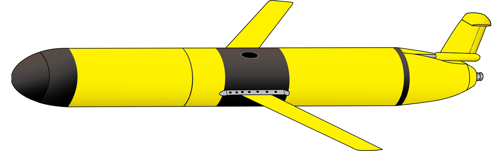
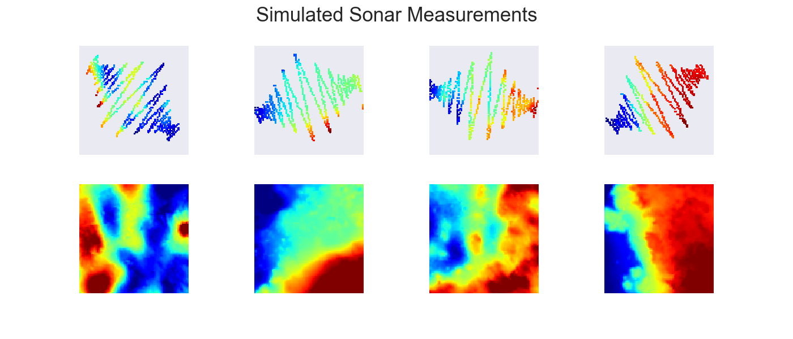

<a href="https://github.com/zduguid">
    
</a>


# Adversarial Autoencoder for Predicting Bathymetry
An Adversarial Autoencoder (AAE) is a type of Generative Adversarial Network (GAN) that utilizes adversarial training in order to perform inference. AAEs perform particularly well when it comes to generative modeling and semi-supervised classification. This repository explores the possibility of using an AAE to aid in the data processing pipeline for Autonomous Underwater Vehicles (AUVs). Specifically, the goal of this project is to harness the generative power of AAEs to make complete-coverage bathymetric predictions given sparse-coverage AUV-acquired sonar measurements. This repository is a work in progress.


## Table of Contents
- [Getting Started](#getting-started)
    - [Dependencies](#dependencies)
- [Data Simulation](#data-simulation)
- [Acknowledgements](#acknowledgements)


## Getting Started 
To run this script, you will need to satisfy the following [Dependencies](#dependencies). The original paper on adversarial autoencoders can be found [here.](https://arxiv.org/abs/1511.05644). Two repositories that were leveraged heavily when writing the adversarial autoencoder Python implementation can be found [here](https://github.com/bstriner/keras-adversarial) and [here.](https://github.com/eriklindernoren/Keras-GAN). Bathymetric data of the Hawaiian Islands is available [here.](http://www.soest.hawaii.edu/pibhmc/cms/)


### Dependencies 
* All scripts in this repository are written in ```Python3``` [(Python3 Download)](https://www.python.org/downloads/)
* ```Keras``` is used to create the machine learning architecture [(Keras)](https://keras.io) 
* ```TensorFlow``` is used as the backend of ```Keras``` [(TensorFlow)](https://www.tensorflow.org)
* ```numpy``` is used to create array objects [(numpy)](http://www.numpy.org)
* ```matplotlib``` is used to create various plots [(matplotlib)](https://matplotlib.org)
* ```pandas``` is used for data analysis [(pandas)](https://pandas.pydata.org)
* ```seaborn``` is used to visualize data [(seaborn)](https://seaborn.pydata.org)


## Data Simulation




## Author
* **[Zach Duguid](https://github.com/zduguid)**


## Acknowledgements
* Australian Centre for Field Robotics (ACFR), University of Sydney
* Woods Hole Oceanographic Institution (WHOI)
* Research Supervisor: Oscar Pizarro