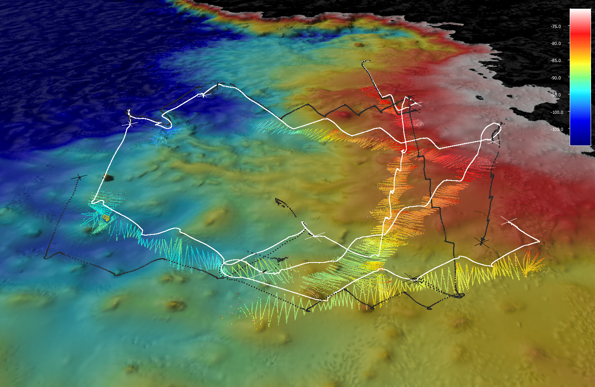
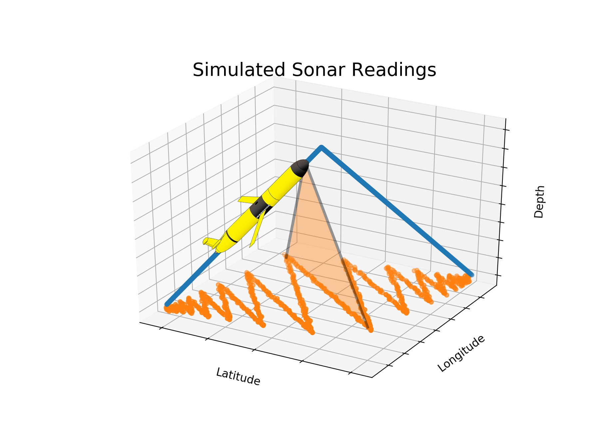
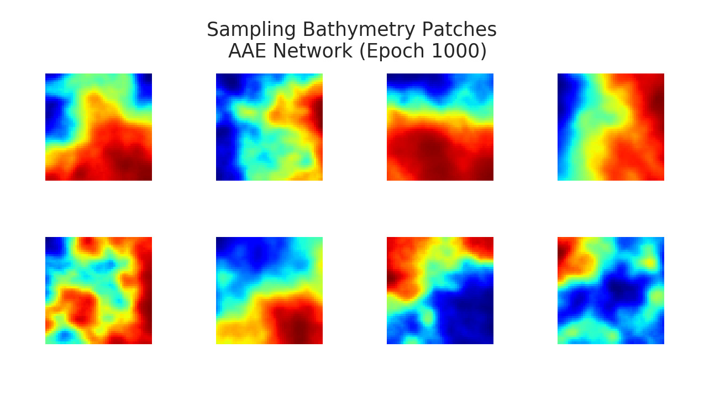
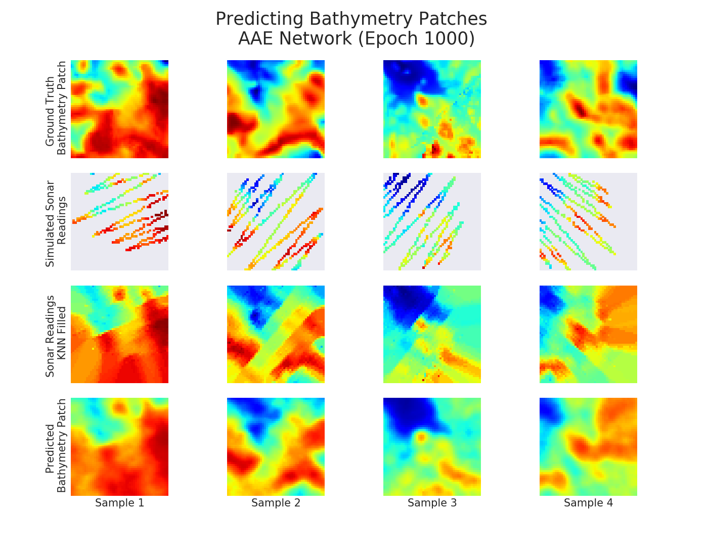

<a href="https://github.com/zduguid">
    
</a>


# Adversarial Autoencoder for Predicting Bathymetry
An Adversarial Autoencoder (AAE) is a type of Generative Adversarial Network (GAN) that utilizes adversarial training in order to perform inference. AAEs perform particularly well when it comes to generative modeling and semi-supervised classification. This repository explores the possibility of using an AAE to aid in the data processing pipeline for Autonomous Underwater Vehicles (AUVs). Specifically, the goal of this project is to harness the generative power of AAEs to make bathymetric predictions given sparse-coverage AUV-acquired sonar measurements.


## Table of Contents
- [Getting Started](#getting-started)
    - [Dependencies](#dependencies)
- [Motivation](#motivation)
- [Simulation](#simulation)
- [Bathymetry Predictions](#bathymetry-predictions)
- [Acknowledgements](#acknowledgements)


## Getting Started 
To run this script, you will need to satisfy the following [Dependencies](#dependencies). The original paper on adversarial autoencoders can be found [here](https://arxiv.org/abs/1511.05644). Two repositories that were leveraged heavily when developing the adversarial autoencoder Python implementation can be found [here](https://github.com/bstriner/keras-adversarial) and [here](https://github.com/eriklindernoren/Keras-GAN). Bathymetric data of the Hawaiian Islands is available [here](http://www.soest.hawaii.edu/pibhmc/cms/).


### Dependencies 
* All scripts in this repository are written in ```Python3``` [(Python3 Download)](https://www.python.org/downloads/)
* ```Keras``` is used to create the machine learning architecture [(Keras)](https://keras.io) 
* ```TensorFlow``` is used as the backend of ```Keras``` [(TensorFlow)](https://www.tensorflow.org)
* ```numpy``` is used to create array objects [(numpy)](http://www.numpy.org)
* ```matplotlib``` is used to create various plots [(matplotlib)](https://matplotlib.org)
* ```pandas``` is used for data analysis [(pandas)](https://pandas.pydata.org)
* ```seaborn``` is used to visualize data [(seaborn)](https://seaborn.pydata.org)


## Motivation 



Autonomous Underwater Vehicles (AUVs) are commonly used for ocean exploration, often in dangerous and unknown environments. Due to the power constraints and risks involved, AUVs are not typically equipped with expensive high-resolution sensors. As a result, instruments such as acoustic sonar only achieve a partial coverage of the underlying bathymetry. The image above shows an example of AUV-retrieved sonar measurements overlaid on a ground truth bathymetry map. To maximize the information gain from partial coverage sonar measurements, I propose a GAN-based approach to predict the missing sonar information.


## Simulation



To make learning more effective, large sets of training data must be generated. To do so, a simulation model is developed by parameterizing the dynamics of the Slocum Glider and the Scanning Sonar. This parameterization is illustrated in the image above. Noise is introduced to the simulation model to make the generated data more realistic. Once the data is generated, the AAE network can be trained with stochastic gradient decent in two alternating learning phases: the reconstruction phase and the regularization phase.


## Bathymetry Predictions

Only the results of the AAE network will be discussed here, however, the low-level design of the AAE network can be viewed in the ```aae.py``` file. First, the image below shows the result of generating bathymetry samples from a random noise vector. Since the samples appear semantically similar to real-world bathymetry patches, we are confident that the AAE network is learning a useful feature-based representation of the underlying bathymetry distribution. 



Next, the image below image below shows the result of making bathymetry predictions given a sparse-matrix input into the AAE network. It is shown that the AAE output is qualitatively similar to the ground truth bathymetry patch, giving us confidence regarding the usage of an AAE network as a bathymetry prediction tool.




## Author
* **[Zach Duguid](https://zduguid.github.io)**


## Acknowledgements
* Australian Centre for Field Robotics (ACFR), University of Sydney
* Woods Hole Oceanographic Institution (WHOI)
* Research Supervisor: Oscar Pizarro